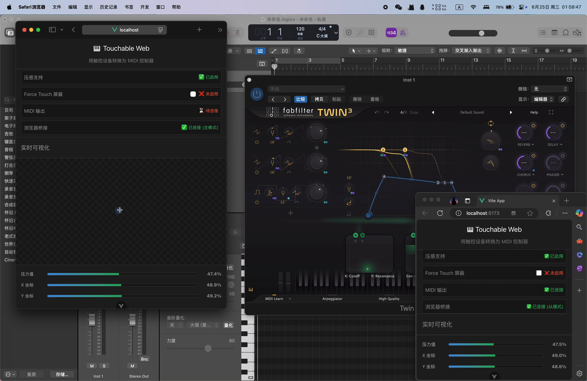

# 🎹 Touchable Web

> 将触控设备转换为专业 MIDI 控制器的现代化 Web 应用




## ✨ 功能特性

### 🎯 核心功能

- **压感输入支持** - 真实压力检测，支持 MacBook 触控板、触屏设备和数位板
- **MIDI 输出** - 实时转换为标准 MIDI CC 消息，兼容所有 DAW 软件
- **实时可视化** - 直观显示压力值、坐标位置和参数变化
- **PWA 应用** - 可安装到桌面，离线使用，类原生体验

### 🌉 跨浏览器桥接

- **主从模式** - Safari (主) + Chrome/Edge (从) 协作工作
- **自动识别** - 智能判断浏览器角色，无需手动配置
- **实时同步** - 压感数据和 MIDI 设置跨浏览器实时同步
- **零延迟** - WebSocket 连接确保最低延迟传输

### 🎛️ 专业 MIDI 控制

- **自定义映射** - 自由配置 CC 号、MIDI 通道和参数名称
- **多设备支持** - 智能检测并选择 MIDI 输出设备
- **参数控制** - 压力值、X/Y 坐标独立映射到不同 CC
- **Force Touch 屏蔽** - 针对 MacBook 用户的压感优化

### 🎨 现代化界面

- **深色模式** - 自适应系统主题，护眼友好
- **响应式设计** - 完美适配桌面、平板和手机
- **直观操作** - 清晰的状态指示和参数显示
- **零干扰** - 禁用文本选择，专注音乐创作

## 🚀 快速开始

### 环境要求

- Node.js 18+
- 现代浏览器 (Chrome 70+, Safari 14+, Firefox 85+)
- MIDI 设备或软件 (可选)

### 安装运行

```bash
# 克隆项目
git clone https://github.com/yourusername/Touchable-web.git
cd Touchable-web

# 安装依赖
npm install

# 启动开发服务器
npm run dev

# 访问应用
open http://localhost:5173
```

### 桥接服务器 (可选)

如需使用跨浏览器功能，需启动桥接服务器：

```bash
# 启动桥接服务器
node bridge-server.mjs

# 服务器运行在 ws://localhost:8080
```

## 📱 使用指南

### 基础使用

1. **打开应用** - 在支持压感的设备上访问 Touchable Web
2. **检测能力** - 应用自动检测浏览器和设备能力
3. **连接 MIDI** - 自动发现并连接 MIDI 设备
4. **开始演奏** - 在触控区域滑动和按压即可输出 MIDI

### 跨浏览器协作

**场景**: 在 MacBook 上使用 Safari 获得最佳压感体验，同时在 Chrome 中连接 MIDI 设备

1. **启动桥接服务器**

   ```bash
   node bridge-server.mjs
   ```

2. **Safari (主模式)**

   - 打开 Touchable Web
   - 自动连接桥接服务
   - 显示 "主模式" 状态
   - 进行触控操作

3. **Chrome (从模式)**
   - 在另一个窗口/设备打开相同地址
   - 自动连接为从模式
   - 接收 Safari 的压感数据
   - 输出 MIDI 到连接的设备

### MIDI 映射配置

**参数映射**:

- 压力值 → CC 1 (调制轮)
- X 坐标 → CC 74 (滤波器频率)
- Y 坐标 → CC 71 (滤波器共鸣)

**自定义设置**:

1. 勾选要启用的参数
2. 修改 CC 号 (0-127)
3. 设置 MIDI 通道 (1-16)
4. 自定义参数名称
5. 选择输出设备

**Force Touch 屏蔽**:

- 适用于 MacBook 用户
- 屏蔽超过 50% 的压感输入
- 将 0-50% 映射到 0-100%
- 避免意外触发

## 🛠️ 技术架构

### 前端技术栈

```
Vue 3 + TypeScript + Vite
├── 组件化架构
├── Composition API
├── 响应式数据流
└── TypeScript 类型安全
```

### 核心模块

**压感检测** (`Pressure.js`)

- 真实压力值检测
- 多点触控支持
- 跨平台兼容

**MIDI 处理** (`WebMIDI.js`)

- Web MIDI API 封装
- 设备管理
- 实时消息发送

**浏览器桥接** (`BrowserBridge.ts`)

- WebSocket 通信
- 主从角色管理
- 数据同步协议

**能力检测** (`CapabilityDetector.ts`)

- 浏览器特性检测
- 智能降级策略
- 用户引导提示

### 桥接协议

```typescript
interface BridgeMessage {
  type: 'pressure' | 'midi' | 'midi-settings' | 'status'
  data: PressureData | MidiData | MidiSettings | StatusData
  timestamp: number
}
```

**消息类型**:

- `pressure`: 压感数据 (主→从)
- `midi`: MIDI 输出确认 (从→主)
- `midi-settings`: 映射配置同步 (主→从)
- `status`: 连接状态更新

## 🔧 开发指南

### 项目结构

```
src/
├── components/          # 可复用组件
├── views/              # 页面组件
│   └── HomeView.vue    # 主页面
├── utils/              # 工具模块
│   ├── BrowserBridge.ts    # 桥接服务
│   └── CapabilityDetector.ts # 能力检测
├── stores/             # 状态管理
├── styles/             # 全局样式
└── main.ts            # 应用入口
```

### 开发命令

```bash
npm run dev          # 开发服务器
npm run build        # 生产构建
npm run preview      # 预览构建结果
npm run type-check   # TypeScript 检查
npm run lint         # 代码检查
```

### 自定义配置

**Vite 配置** (`vite.config.ts`)

```typescript
export default defineConfig({
  plugins: [vue(), VitePWA(pwaConfig)],
  resolve: {
    alias: { '@': fileURLToPath(new URL('./src', import.meta.url)) },
  },
})
```

**PWA 配置** (`src/pwa.ts`)

- 离线缓存策略
- 应用清单配置
- 服务工作者注册

## 🌏 浏览器兼容性

### 完全支持 ✅

- **Safari 14+** (macOS/iOS) - 最佳压感体验
- **Chrome 70+** - 完整 MIDI 支持
- **Edge 79+** - 完整功能支持

### 部分支持 ⚠️

- **Firefox 85+** - 基础功能，无压感检测
- **移动浏览器** - 触控支持，MIDI 受限

### 功能对比表

| 浏览器  | 压感检测  | MIDI 输出 | 桥接支持  | PWA |
| ------- | --------- | --------- | --------- | --- |
| Safari  | ✅ 完整   | ❌ 不支持 | ✅ 主模式 | ✅  |
| Chrome  | ⚠️ 有限   | ✅ 完整   | ✅ 从模式 | ✅  |
| Edge    | ⚠️ 有限   | ✅ 完整   | ✅ 从模式 | ✅  |
| Firefox | ❌ 不支持 | ⚠️ 实验性 | ✅ 支持   | ✅  |

## 📝 使用案例

### 音乐制作

- **Logic Pro** - 实时控制合成器参数
- **Ableton Live** - 现场演出控制器
- **FL Studio** - 创意性参数调制

### 现场演出

- **触控板控制** - MacBook 作为便携控制器
- **多设备协作** - 不同浏览器分工合作
- **零延迟响应** - 实时音乐表演

### 教学演示

- **MIDI 原理教学** - 可视化 MIDI 消息
- **交互式演示** - 直观的参数控制
- **跨平台展示** - 任何设备都能运行

## 🤝 贡献指南

### 报告问题

1. 在 [Issues](https://github.com/yourusername/Touchable-web/issues) 中搜索相似问题
2. 提供详细的复现步骤
3. 包含浏览器版本和设备信息

### 提交代码

1. Fork 项目仓库
2. 创建特性分支: `git checkout -b feature/amazing-feature`
3. 提交更改: `git commit -m 'Add amazing feature'`
4. 推送分支: `git push origin feature/amazing-feature`
5. 提交 Pull Request

### 开发约定

- 使用 TypeScript 编写代码
- 遵循 Vue 3 Composition API 最佳实践
- 添加适当的注释和类型声明
- 确保代码通过 ESLint 检查

## 📄 许可证

本项目基于 [MIT 许可证](LICENSE) 开源。

## 🙏 致谢

感谢以下开源项目的支持：

- [Vue.js](https://vuejs.org/) - 渐进式 JavaScript 框架
- [Vite](https://vitejs.dev/) - 下一代前端构建工具
- [Pressure.js](https://pressurejs.com/) - 压感检测库
- [WebMIDI.js](https://webmidijs.org/) - MIDI API 封装

## 📞 联系方式

- 项目主页: [https://github.com/yourusername/Touchable-web](https://github.com/yourusername/Touchable-web)
- 问题反馈: [Issues](https://github.com/yourusername/Touchable-web/issues)
- 邮箱: your.email@example.com

---

**🎵 让音乐创作更加触手可及！**
